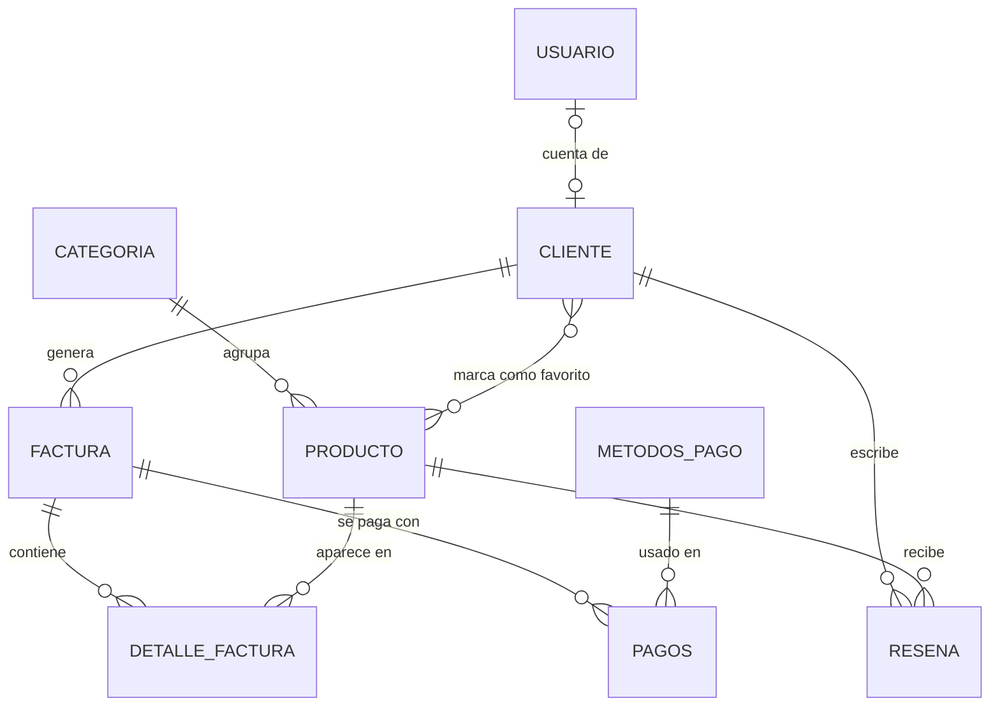

# 🪑 Arte & Diseño — API

Backend del proyecto integrador **Arte & Diseño**, una tienda en línea de muebles.
Construido con **Spring Boot** y **PostgreSQL (Neon)**.

> **Estado actual — Avance 1:** modelado del dominio y mapeo de entidades JPA.
> Todavía no hay endpoints REST; las tablas se generan automáticamente al arrancar la aplicación.

---

## 📑 Tabla de contenido

- [Stack tecnológico](#-stack-tecnológico)
- [Estructura del proyecto](#-estructura-del-proyecto)
- [Modelo de dominio](#-modelo-de-dominio)
- [Requisitos previos](#-requisitos-previos)
- [Configuración local](#️-configuración-local)
- [Flujo de trabajo Git](#-flujo-de-trabajo-git)
- [Entrega](#-entrega)

---

## 🛠 Stack tecnológico

| Tecnología | Versión | Uso |
|---|---|---|
| Java | 17 | Lenguaje |
| Spring Boot | 4.1.0 | Web MVC, Data JPA, DevTools |
| PostgreSQL | Neon (cloud) | Base de datos |
| Hibernate | (incluido en Spring Boot) | ORM |
| Lombok | — | Reducción de código repetitivo |
| Maven | Wrapper incluido (`mvnw`) | Build y dependencias |

---

## 📂 Estructura del proyecto

```
src/main/java/com/cesde/arteydiseno/
├── ArteYDisenoApplication.java      # Punto de entrada
└── model/
    ├── base/
    │   └── BaseEntity.java          # Campos comunes a todas las entidades
    ├── embeddable/
    │   └── DireccionEnvio.java      # Dirección incrustada en Factura
    ├── entity/
    │   ├── Categoria.java
    │   ├── Cliente.java
    │   ├── DetalleFactura.java
    │   ├── Factura.java
    │   ├── MetodosPago.java
    │   ├── Pagos.java
    │   ├── Producto.java
    │   ├── Reseña.java
    │   └── Usuario.java
    └── enums/
        └── EstadoProducto.java

src/main/resources/
└── application.properties           # Lee las credenciales desde variables de entorno
```

---

## 🧩 Modelo de dominio

### Diagrama entidad-relación



### Relaciones

| Relación | Tipo | Columna / tabla |
|---|---|---|
| `Categoria` → `Producto` | 1:N | `producto.categoria_id` |
| `Cliente` → `Factura` | 1:N | `factura.cliente_id` |
| `Cliente` → `Reseña` | 1:N | `reseña.cliente_id` |
| `Producto` → `Reseña` | 1:N | `reseña.producto_id` |
| `Cliente` ↔ `Producto` (favoritos) | N:M | tabla intermedia `cliente_producto_favorito` |
| `Factura` → `DetalleFactura` | 1:N (cascade + orphanRemoval) | `detalle_factura.pedido_id` |
| `Producto` → `DetalleFactura` | N:1 | `detalle_factura.producto_id` |
| `Factura` → `Pagos` | N:1 desde `Pagos` | `pagos.factura_id` |
| `MetodosPago` → `Pagos` | 1:N | `pagos.metodo_pago_id` |
| `Usuario` → `Cliente` | 1:1 (opcional) | `usuario.cliente_id` (único) |

### Clase base — `BaseEntity`

Superclase `@MappedSuperclass` de la que heredan todas las entidades:

| Campo | Tipo | Descripción |
|---|---|---|
| `id` | `Long` | Identificador autoincremental (`IDENTITY`) |
| `fechaCreacion` | `LocalDateTime` | Se asigna en `@PrePersist` |
| `fechaActualizacion` | `LocalDateTime` | Se actualiza en `@PreUpdate` |
| `estadoActivo` | `Boolean` | Borrado lógico (`true` por defecto) |

### Entidades

| Entidad | Campos principales |
|---|---|
| `Categoria` | nombre (único), descripción |
| `Producto` | nombre, descripción, precio, stock, estadoProducto |
| `Cliente` | nombreCompleto, correo (único), teléfono (único) |
| `Usuario` | email (único), passwordHash, rol |
| `Factura` | fechaFactura, estadoFactura, direccionEnvio |
| `DetalleFactura` | cantidad, precioUnitario |
| `MetodosPago` | nombre (único), activo |
| `Pagos` | monto, fechaPago, referencia |
| `Reseña` | calificación, comentario |

### Embeddable — `DireccionEnvio`

Se incrusta en `Factura` con `@Embedded` (sus columnas quedan dentro de la tabla `factura`):
`calle`, `ciudad`, `departamento`, `codigoPostal`.

### Enumeraciones

| Enum | Valores | Mapeo |
|---|---|---|
| `EstadoProducto` | `DISPONIBLE`, `AGOTADO`, `DESCONTINUADO` | `@Enumerated(EnumType.STRING)` |

---

## ✅ Requisitos previos

- **JDK 17** o superior (`java -version`)
- Una base de datos **PostgreSQL en [Neon](https://neon.tech)** (el plan gratuito es suficiente)
- **Git**
- No hace falta instalar Maven: el proyecto trae el wrapper (`mvnw` / `mvnw.cmd`).

---

## ⚙️ Configuración local

1. **Clona el repositorio** y entra a la carpeta:
   ```bash
   git clone https://github.com/SESsantiago/arte-y-dise-o-api.git
   cd arte-y-dise-o-api
   ```

2. **Configura las variables de entorno** con los datos de tu instancia de Neon (usa `.env.template` como guía):

   | Variable | Descripción | Ejemplo |
   |---|---|---|
   | `DB_URL` | URL JDBC de Neon | `jdbc:postgresql://<host>.neon.tech/<database>?sslmode=require` |
   | `DB_USERNAME` | Usuario de la base de datos | `neondb_owner` |
   | `DB_PASSWORD` | Contraseña | `********` |
   | `PORT` | Puerto de la API (opcional) | `8080` |

   Spring **no lee archivos `.env` por sí solo**. Defínelas en la configuración de ejecución de tu IDE
   (IntelliJ: *Run → Edit Configurations → Environment variables*) o en la terminal antes de ejecutar:

   ```powershell
   # PowerShell
   $env:DB_URL="jdbc:postgresql://<host>.neon.tech/<database>?sslmode=require"
   $env:DB_USERNAME="<usuario>"
   $env:DB_PASSWORD="<password>"
   ```

   > ⚠️ **Nunca** subas credenciales reales al repositorio.

3. **Compila** el proyecto:
   ```bash
   ./mvnw clean compile
   ```

4. **Ejecuta** la aplicación:
   ```bash
   ./mvnw spring-boot:run
   ```

Si todo sale bien, la API arranca en `http://localhost:8080` y Hibernate crea o actualiza las tablas en Neon (`ddl-auto=update`). Las consultas SQL se muestran en consola (`show-sql=true`).

### Problemas comunes

| Síntoma | Posible causa |
|---|---|
| `Could not resolve placeholder 'DB_URL'` | Las variables de entorno no están definidas |
| `Connection refused` / timeout | URL de Neon incorrecta o falta `?sslmode=require` |
| `password authentication failed` | Usuario o contraseña incorrectos |
| Errores de Lombok (getters no encontrados) | Activa el *annotation processing* en tu IDE |

---

## 🌿 Flujo de trabajo Git

Usamos un **Git Flow simplificado**:

| Rama | Propósito |
|---|---|
| `main` | Rama estable; solo recibe merges vía Pull Request |
| `develop` | Integración de los avances del equipo |
| `feature/<nombre-funcionalidad>` | Una rama por funcionalidad, creada desde `develop` |

### Antes de tu primer commit

Configura tu identidad para que la evidencia individual quede bien atribuida:

```bash
git config user.name "Tu Nombre Apellido"
git config user.email "tu_correo@cesde.net"
```

### Flujo por funcionalidad

```bash
git checkout develop
git pull
git checkout -b feature/nombre-funcionalidad
# ... trabajo y commits ...
git push -u origin feature/nombre-funcionalidad
# Abre un Pull Request hacia develop
```

**Buenas prácticas:**
- Commits pequeños y con mensajes descriptivos (ej. `feat: agrega entidad Pagos`).
- Haz `git pull` de `develop` antes de abrir el PR para evitar conflictos.
- Verifica que el proyecto compile (`./mvnw clean compile`) antes de hacer push.

---

## 📦 Entrega

- Cada integrante hace **su propio envío** en la plataforma.
- El repositorio remoto debe **compilar correctamente** con `./mvnw clean compile`.
- La aplicación debe **conectarse a la base de datos** configurada en Neon.

---

**Proyecto académico — CESDE · Backend 2 · Semestre 3**
